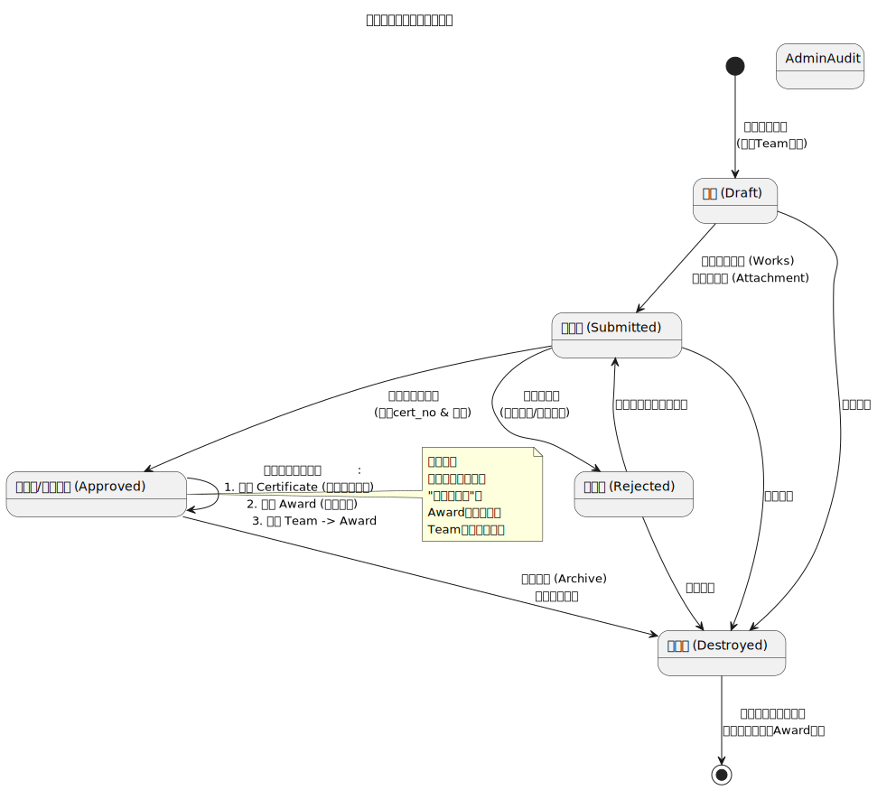
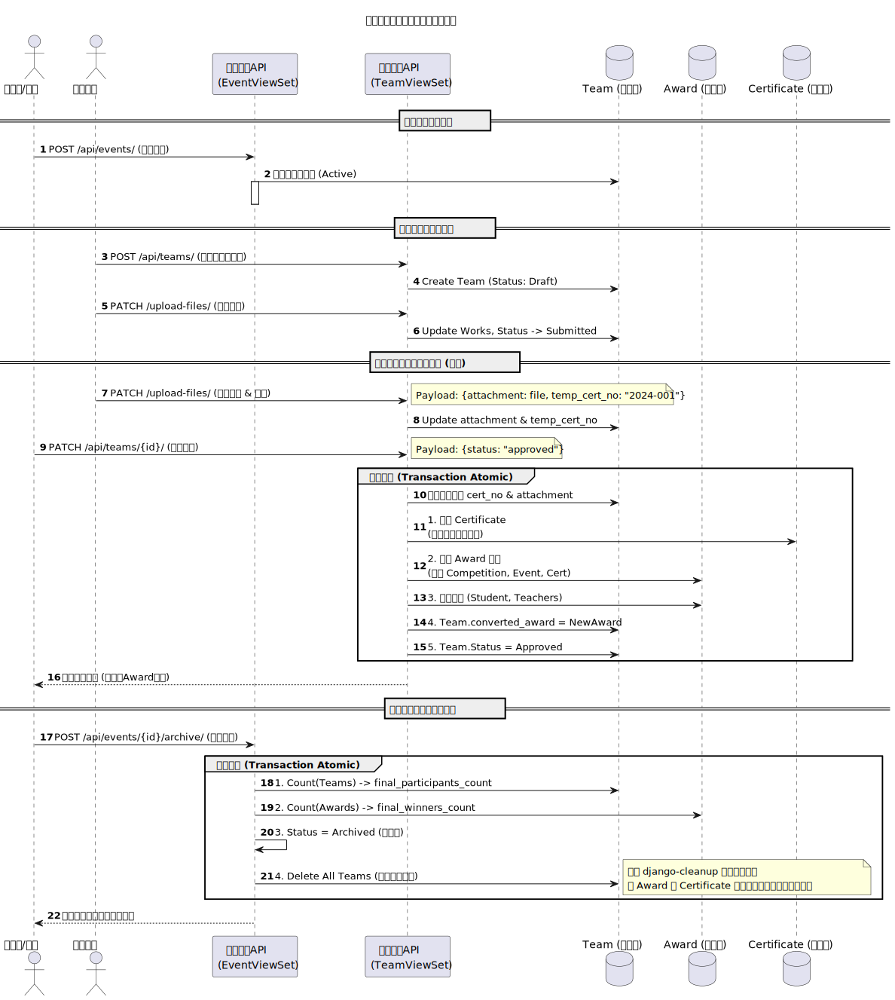
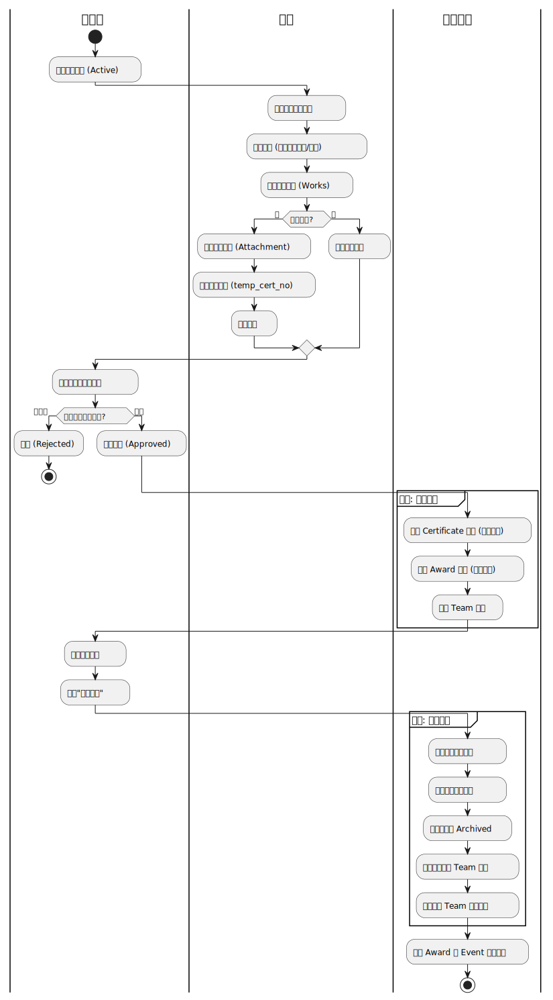

# 学科竞赛管理系统后端

## 1.项目初始化方式

```shell
chmod +x setup.sh
./setup.sh
```

## 2.核心功能介绍

### 2.1 核心管理逻辑：从“固定”到“动态”

为了解决比赛名称不规范、届次混乱的问题，系统将竞赛数据分为两个层级：

2.1.1. **竞赛元数据（库）**：
* **固定名录**：预设约 100 项核心比赛（如蓝桥杯、ICPC 等）。
* **规范化字段**：固定比赛名称、**等级（A/B/C类，设为下拉菜单强制选择）**。
* **属性定义**：区分“自有报名系统”和“校赛系统”两类。

2.1.2. **竞赛活动（年度/届次）**：
* **发布机制**：管理员基于元数据发布“2026年第十七届蓝桥杯”活动。
* **动态属性**：设置该届比赛的级别（省/国）、年份、届次及报名截止时间。

### 2.2 业务流程与功能实现

#### 2.2.1. 组队与报名阶段（解决“找队友/找老师”问题）

* **发布通知**：面向全院/全校发布活动，集成通知推送。
* **动态组队**：学生队长通过“竞赛活动”页面创建队伍，并拉起队员和指导老师入队。

* **筛选与管理**：
* 提供校赛、答辩筛选流程。
* **缴费管理**：记录报名费缴纳状态，支持初筛后的合格名单导出。
* **一键导出**：生成符合官方系统格式的 Excel，直接用于外部系统导入。


#### 2.2.2. 结果导入与审核（解决“重复与真实性”问题）

* **补充录入**：
* **提供原始的奖项录入机制**：由学生提供参赛信息、获奖信息和证书信息报管理员审核是否录入。

* **审核防重机制**：
* **唯一获奖记录**：系统根据“竞赛活动+获奖等级+学生ID”进行冲突检测。
* **队长责任制**：仅限队长上传证书，避免团队比赛中多名队员重复提交导致的统计误差。


### 2.3. 数据归档与生命周期管理

* **闭环管理**：
* 所有获奖记录审核完毕后，管理员执行“关闭活动”。
* **自动统计**：系统根据审核通过的记录，自动将参与人数、获奖等级归档。

* **销毁机制**：
* 活动关闭后，系统自动销毁临时团队的冗余过程数据，仅保留正式的**获奖名录**。
* **高效统计**：实现“动态竞赛、动态团队、唯一记录”的轻量化运营。


### 2.4. 数据分析维度

系统将自动生成多维度的可视化分析报表，支持专业建设与学院考核：

| 维度       | 分析指标                             |
|----------|----------------------------------|
| **学生维度** | 参与人数、专业分布、参赛增长率。                 |
| **组织维度** | 班级/专业参与率、学院整体获奖增长率、专业建设贡献度。      |
| **师资维度** | 指导老师指导项数、获奖率、带队数据统计。             |
| **竞赛维度** | A/B/C类级别比赛覆盖率、不同类别比赛覆盖率、各届次水平对比。 |

### 2.5. 图

**状态机图**



**时序图**



**活动图**

